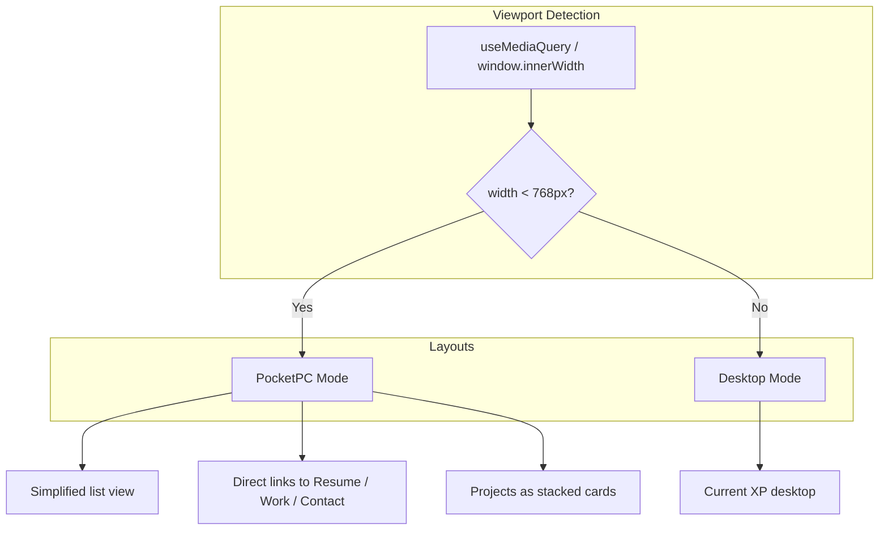
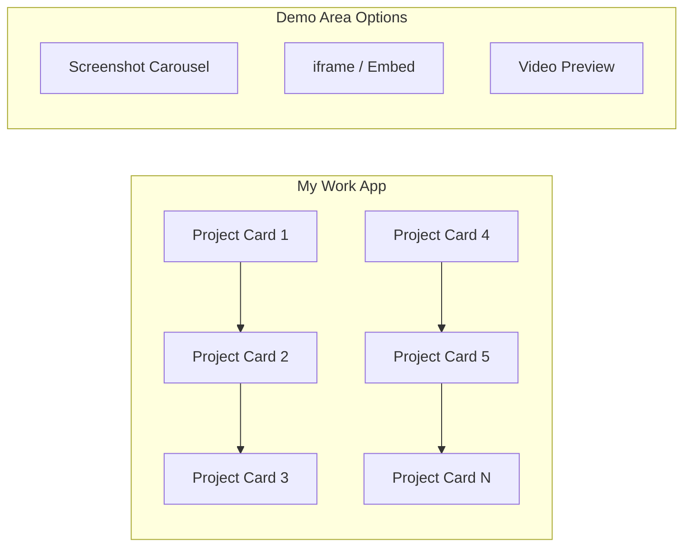

# Portfolio Website Revamp Plan

This plan organizes your roadmap into actionable phases, with technical specifics based on your current codebase.

---

## Current State Summary

| Area                  | Current Implementation                                                                                                                            |
| --------------------- | ------------------------------------------------------------------------------------------------------------------------------------------------- |
| **Works**             | [MyWork.tsx](winxpsite/src/programs/MyWork.tsx) – Left accordion (Work/Hackathons/Personal) + right content panel; project selected one at a time |
| **Initial load**      | [tabSlice.tsx](winxpsite/src/redux/tabSlice.tsx) – Only Welcome window opens; tray starts with 1 tab                                              |
| **Window positions**  | [WinForm.tsx](winxpsite/components/WinForm/WinForm.tsx) – `currX`/`currY` in local component state (lines 31–32); lost on refresh                 |
| **Mobile**            | Basic media queries in globals/Home/MyWork CSS; no alternate layout; desktop icons positioned by `appID * 90`                                     |
| **State persistence** | None – Redux store resets on refresh                                                                                                              |
| **Supabase**          | Not integrated – only referenced in WorkData/TechIcon                                                                                             |
| **Backend**           | No API routes; contact form uses Mailgun/emailjs                                                                                                  |

---

## Phase 1: Core Usability (High Priority)

### 1.1 Mobile Optimization – Safe Mode / Pocket PC Mode

**Approach:** Add a viewport-driven layout switch. Below `768px`, render an alternate "Safe Mode" or "Pocket PC" UI instead of the desktop shell.

**Implementation:**

- Create `useMobileLayout` hook (e.g. `window.matchMedia('(max-width: 768px)')`) or pass `isMobile` from a layout provider.
- Add `MobileLayout.tsx` (or `SafeModeLayout.tsx`): vertical list of sections (About, Work, Contact, Resume, GitHub, LinkedIn) styled like a 2000s PDA (simple borders, grayscale, large touch targets).
- In [index.tsx](winxpsite/src/pages/index.tsx): conditionally render `<MobileLayout />` vs `<DesktopLayout />` (existing desktop + StartBar).
- For projects: show all [WorkData](winxpsite/src/appData/index.tsx) as cards in a single scrollable view; tap to expand details (reuse existing Overview, tech badges, GitHub) or open a detail modal.

**Files:** New `src/components/MobileLayout/`, new hook, update [index.tsx](winxpsite/src/pages/index.tsx).

---

### 1.2 Auto-Opening Windows on Load

**Implementation:**

- Edit [tabSlice.tsx](winxpsite/src/redux/tabSlice.tsx) `initialState.tray`.
- Replace single Welcome tab with 2–3 pre-loaded tabs:
  - Welcome (existing, `program: App.WELCOME`)
  - My Work (`program: App.MYWORK`, from `AppDirectory.get(2)`)
  - Optional: "Cool Things" tab – either a new `App` enum + program component (quick links, highlights) or a variant of Welcome with different content.
- Use `uuid` for each tab’s `id` in initialState.
- Set `isMinimized: false` for all.

**Files:** [tabSlice.tsx](winxpsite/src/redux/tabSlice.tsx), [types/index.tsx](winxpsite/src/types/index.tsx) (if adding new App).

---

## Phase 2: Works Section Revamp

### 2.1 Single-Page Project Gallery with Demos

**Current:** Accordion sidebar + single project detail on the right.

**Target:** One page with all projects visible, each showing:

- Project title, date, type badge (Work / Hackathon / Personal)
- Demo area (screenshot carousel or embedded iframe/video for live demos)
- Short overview snippet
- "View Details" / "Open" to expand or open full project view

**Implementation:**

1. **Data model:** Extend `WorkContent` in [types/index.tsx](winxpsite/src/types/index.tsx) with optional:
  - `demoUrl?: string` (live app URL for iframe)
  - `videoUrl?: string` (Loom/YouTube embed)
  - Keep existing `gallery` for screenshots.
2. **Layout:** Replace accordion layout in [MyWork.tsx](winxpsite/src/programs/MyWork.tsx) with a responsive grid (e.g. 1–2 columns on mobile, 2–3 on tablet, 3–4 on desktop).
3. **Project card component:**
  - Top: First `gallery` image or placeholder; click to cycle or open lightbox.
  - Middle: Title, date, type badge, 1–2 line overview.
  - Bottom: Tech badges row, "View on GitHub" if `gitURL`, "View Details" button.
4. **Detail view:** On "View Details", either:
  - **Option A:** Inline expand (accordion-style) within the same page.
  - **Option B:** Open a modal/dialog with full Overview, Carousel, tech stack.
  - **Option C:** New sub-route or program window for project detail (keeps XP metaphor).

**Recommended:** Option B – modal keeps users in My Work, works well on mobile.

**Files:** [MyWork.tsx](winxpsite/src/programs/MyWork.tsx), [MyWork.module.css](winxpsite/src/programs/MyWork.module.css), [appData/index.tsx](winxpsite/src/appData/index.tsx), new `ProjectCard.tsx` (and optional `ProjectDetailModal.tsx`).

---

## Phase 3: Interactive & Creative Features

### 3.1 Clippy-Style Website Guide

**Implementation:**

- Add `WebsiteGuide.tsx`: an animated paperclip/search-dog sprite that floats near a fixed position (e.g. bottom-right).
- Use a simple step-based tour (e.g. 5–7 steps): Start button, Desktop icons, My Work, Guestbook, etc.
- Each step: highlight target (CSS outline/overlay), show tooltip next to guide.
- Store "tour completed" in `localStorage` to avoid repeating.
- Add `aria-live` for screen readers.

**Files:** New `components/WebsiteGuide/`, integrate in [index.tsx](winxpsite/src/pages/index.tsx) or layout.

---

### 3.2 Live Guestbook (Notepad.exe)

**Implementation:**

- **Supabase setup:** Create project, add `guestbook` table: `id`, `name`, `message`, `created_at`.
- **API:** Next.js API routes: `POST /api/guestbook` (insert), `GET /api/guestbook` (list).
- **Notepad app:** New `Notepad.tsx` program (or `Guestbook.tsx`) styled like Notepad: menu bar, textarea, "Save" button that POSTs to API.
- **Display:** List existing entries below the input; optional real-time via Supabase Realtime or poll on focus.
- Add Notepad to `AppDirectory`, Start menu, and desktop (or inside a "Cool Things" section).

**Files:** New Supabase config, API routes, [Notepad.tsx](winxpsite/src/programs/), [appData](winxpsite/src/appData/index.tsx), [types](winxpsite/src/types/index.tsx).

---

### 3.3 Playable Minigame (Minesweeper or Solitaire)

**Implementation:**

- **Minesweeper** demonstrates: 2D array state, recursion (flood fill), event handling.
- Create `Minesweeper.tsx` as a new program; implement classic rules (grid, mine count, reveal, flag).
- Add to `AppDirectory` and Start menu; optionally reuse existing Solitaire desktop icon (appID 7).

**Files:** New `programs/Minesweeper.tsx`, update App enum and routing in [index.tsx](winxpsite/src/pages/index.tsx).

---

### 3.4 Nostalgic Media Player (Winamp-Style)

**Implementation:**

- Create `MediaPlayer.tsx`: draggable Winamp-like skin (playlist, play/pause/stop, progress bar, volume).
- Use `HTMLAudioElement` / `useRef` for playback; store playlist (titles + URLs) in `appData` or a small JSON.
- Optional: keep playing when minimized (global audio context) – requires lifting state to Redux or a provider.
- Add to Start menu; optional desktop shortcut.

**Files:** New `programs/MediaPlayer.tsx`, playlist config in appData.

---

## Phase 4: Employability Enhancements

### 4.1 Web Accessibility (a11y) & Keyboard Navigation

**Implementation:**

- **Focus management:** Ensure all focusable elements (Start button, window controls, desktop icons, menu items) are reachable via `Tab` and activatable via `Enter`/`Space`.
- **ARIA:** Add `aria-label` to icon buttons (minimize, maximize, close), Start button (`aria-label="Start"`), and custom controls.
- **Window focus:** Use `tabIndex={0}` and `onKeyDown` (Enter/Space) for window activation and controls.
- **Desktop icons:** Make each icon focusable; double-click equivalent: Enter on focused icon after single focus.
- **Skip link:** Add "Skip to main content" at top for screen readers.

**Files:** [WinForm.tsx](winxpsite/components/WinForm/WinForm.tsx), [StartBar.tsx](winxpsite/components/StartBar/StartBar.tsx), [DesktopIcon.tsx](winxpsite/components/DesktopIcon/DesktopIcon.tsx), [TrayTab](winxpsite/components/TrayTab/), new `SkipLink` component.

---

### 4.2 State Persistence (Redux Persist)

**Implementation:**

- Install `redux-persist`.
- **Persist `tab` slice:** `tray`, `id`, `currentFocusedTab`, `currentZIndex`.
- **Extend Redux for window positions:** Add `windowPositions: Record<tabId, { x, y, isMaximized }>` to `tab` or `system` slice; update WinForm to read/write from Redux instead of local state.
- Use `localStorage`; configure `persistStore` in [_app.tsx](winxpsite/src/pages/_app.tsx) with `PersistGate` for hydration.

**Files:** [store.tsx](winxpsite/src/redux/store.tsx), [tabSlice.tsx](winxpsite/src/redux/tabSlice.tsx) or [systemSlice.tsx](winxpsite/src/redux/systemSlice.tsx), [WinForm.tsx](winxpsite/components/WinForm/WinForm.tsx), [_app.tsx](winxpsite/src/pages/_app.tsx).

---

### 4.3 Performance Optimization & Lighthouse Score

**Implementation:**

- **next/image:** Ensure all images use `next/image` with `priority` for above-fold, `loading="lazy"` for below-fold.
- **Dynamic imports:** `next/dynamic` for MediaPlayer, Minesweeper, Guestbook (lazy-load when opened).
- **Fonts:** Verify `next/font` usage (you already use local Tahoma) – no render-blocking.
- **System Performance app:** New program that fetches Lighthouse metrics (via a build-time script or external service like PageSpeed Insights API) and displays score in an XP-style "System Properties" window.

**Files:** [next.config.js](winxpsite/next.config.js), dynamic imports in [index.tsx](winxpsite/src/pages/index.tsx), new `SystemPerformance.tsx`.

---

### 4.4 System Logs / CI/CD Viewer (Command Prompt)

**Implementation:**

- Create `CommandPrompt.tsx` or `EventViewer.tsx`: terminal-style UI (monospace, dark background).
- Fetch GitHub Actions workflow runs: `GET https://api.github.com/repos/{owner}/{repo}/actions/runs` (requires GitHub token in env).
- Display last 5–10 runs with status (success/failure), branch, commit message.
- Alternatively: recent commits via `GET /repos/{owner}/{repo}/commits`.

**Files:** New `programs/CommandPrompt.tsx`, API route `getServerSideProps` or `getStaticProps` / API route for server-side fetch to hide token.

---

### 4.5 Custom Display Themes (Display Properties)

**Implementation:**

- Add `systemSlice` state: `theme: 'luna-blue' | 'olive-green' | 'silver'`.
- Define CSS variables per theme (title bar colors, window borders, taskbar).
- Add "Display Properties" program: dialog with theme radio buttons; dispatches `setTheme` to Redux.
- Desktop right-click: currently not implemented – either add context menu component or expose "Display Properties" via Start menu only.

**Files:** [systemSlice.tsx](winxpsite/src/redux/systemSlice.tsx), new `DisplayProperties.tsx`, theme CSS variables in [globals.css](winxpsite/src/styles/globals.css) or new `themes.css`.

---

## Phase 5: Additional Integrations

### Dependencies to Add

| Package                   | Purpose                               |
| ------------------------- | ------------------------------------- |
| `redux-persist`           | State persistence                     |
| `@supabase/supabase-js`   | Guestbook backend                     |
| `react-joyride` or custom | Optional: tour steps for Clippy guide |

---

## Suggested Implementation Order

1. **Works revamp** – biggest UX improvement, no new infrastructure.
2. **Auto-opening windows** – quick win.
3. **Mobile layout** – critical for recruiters on phones.
4. **Redux persist + window positions** – strong technical signal.
5. **a11y + keyboard nav** – incremental across components.
6. **Guestbook (Supabase)** – showcases full-stack skills.
7. **Minesweeper** – fun, demonstrates algorithms.
8. **Media player** – moderate effort.
9. **Clippy guide** – polish.
10. **Display themes** – extends `systemSlice`.
11. **CI/CD viewer** – requires GitHub token setup.
12. **System Performance app** – optional Lighthouse integration.

---

## Risks and Considerations

- **Tab IDs:** Your tabs use `uuidv4()` for `id`, but `Tab` type declares `id: number`. TrayTab and WinForm receive `tab.id`. Align types (use `string` for UUID) to avoid issues with persistence and new features.
- **Window positions with UUID:** When persisting, `Record<tabId, position>` will work with string IDs; ensure WinForm and tab slice use consistent ID types.
- **Supabase:** Requires account and env vars (`NEXT_PUBLIC_SUPABASE_URL`, `SUPABASE_SERVICE_ROLE_KEY` or anon key) for guestbook.

